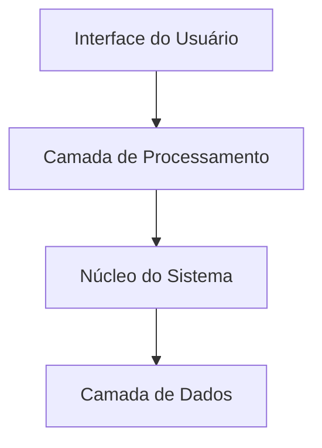
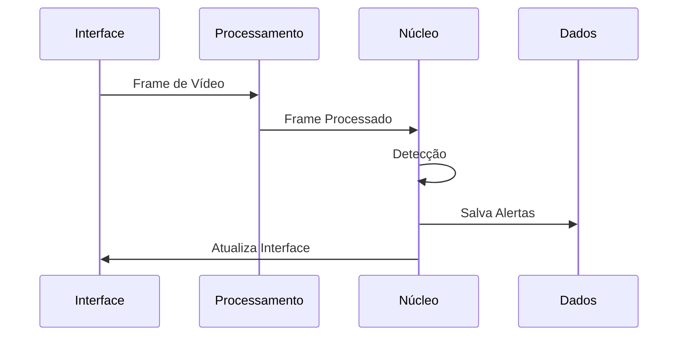

# Visão Geral da Arquitetura - VisionGuard

## Arquitetura do Sistema

### 1. Camadas Principais



#### Interface do Usuário (UI Layer)
- **SecurityCameraApp**: Janela principal
- **VideoTab**: Visualização de vídeo
- **AlertView**: Gerenciamento de alertas
- **SettingsTab**: Configurações do sistema

#### Processamento (Processing Layer)
- **AnalysisWorker**: Processamento assíncrono
- **CameraManager**: Gerenciamento de vídeo
- **VideoUtils**: Utilitários de processamento

#### Núcleo (Core Layer)
- **Detector**: Motor de detecção YOLOv8
- **AlertManager**: Gerenciamento de alertas
- **EmailSender**: Sistema de notificações

#### Dados (Data Layer)
- Armazenamento de alertas
- Cache de frames
- Configurações do sistema
- Logs e métricas

### 2. Fluxo de Dados



## Componentes Principais

### 1. Sistema de Detecção
- Modelo YOLOv8 otimizado
- Processamento em GPU/CPU
- Cache inteligente
- Filtros de confiança

### 2. Processamento de Vídeo
- Suporte multi-fonte
- Processamento assíncrono
- Otimização de frames
- Controle de recursos

### 3. Gerenciamento de Alertas
- Validação de detecções
- Armazenamento persistente
- Sistema de notificações
- Rotação automática

### 4. Interface do Usuário
- Design modular
- Atualização em tempo real
- Controles intuitivos
- Feedback visual

## Otimizações Implementadas

### 1. Performance
- Workers assíncronos
- Cache em múltiplos níveis
- Processamento em batch
- Gerenciamento de memória

### 2. Recursos
- Buffer circular
- Compressão de dados
- Limpeza automática
- Monitoramento de uso

### 3. Interface
- Renderização eficiente
- Throttling de eventos
- Updates em batch
- Cache de UI

## Sistema de Comunicação

### 1. Sinais e Slots
```python
# Exemplos de sinais principais
analysis_complete = pyqtSignal(dict)
metrics_update = pyqtSignal(dict)
alert_triggered = pyqtSignal(str)
```

### 2. Event Loop
- Processamento não-bloqueante
- Gerenciamento de eventos
- Priorização de tarefas
- Timeout handling

## Configurações do Sistema

### 1. Modelo
```python
MODEL_CONFIG = {
    'path': str,
    'confidence_threshold': float,
    'target_height': int
}
```

### 2. Vídeo
```python
VIDEO_CONFIG = {
    'frame_interval': int,
    'analysis_interval': int,
    'max_workers': int
}
```

### 3. Alertas
```python
ALERT_CONFIG = {
    'enable_email': bool,
    'save_frames': bool,
    'min_interval': int
}
```

## Métricas e Monitoramento

### 1. Performance
- FPS médio
- Tempo de processamento
- Uso de memória
- Taxa de detecção

### 2. Sistema
- Workers ativos
- Cache hits/misses
- Uso de recursos
- Erros e warnings

## Considerações Técnicas

### 1. Requisitos
- Python 3.8+
- CUDA (opcional)
- 8GB+ RAM
- CPU multi-core

### 2. Dependências
- PyQt5
- OpenCV
- YOLOv8
- NumPy

### 3. Ambiente
- Windows/Linux
- GPU opcional
- SSD recomendado
- Rede estável

## Boas Práticas

### 1. Desenvolvimento
- Logging extensivo
- Tratamento de erros
- Cleanup de recursos
- Documentação clara

### 2. Operação
- Monitoramento contínuo
- Backup regular
- Atualização de modelos
- Manutenção preventiva

## Pontos de Extensão

### 1. Modelos
- Suporte multi-modelo
- Transfer learning
- Fine-tuning
- Exportação otimizada

### 2. Integrações
- APIs externas
- Sistemas de alerta
- Bancos de dados
- Serviços em nuvem

## Conclusão
O VisionGuard implementa uma arquitetura modular e escalável, com foco em performance e confiabilidade. O sistema é construído para ser facilmente extensível e manutenível, com clara separação de responsabilidades entre seus componentes.