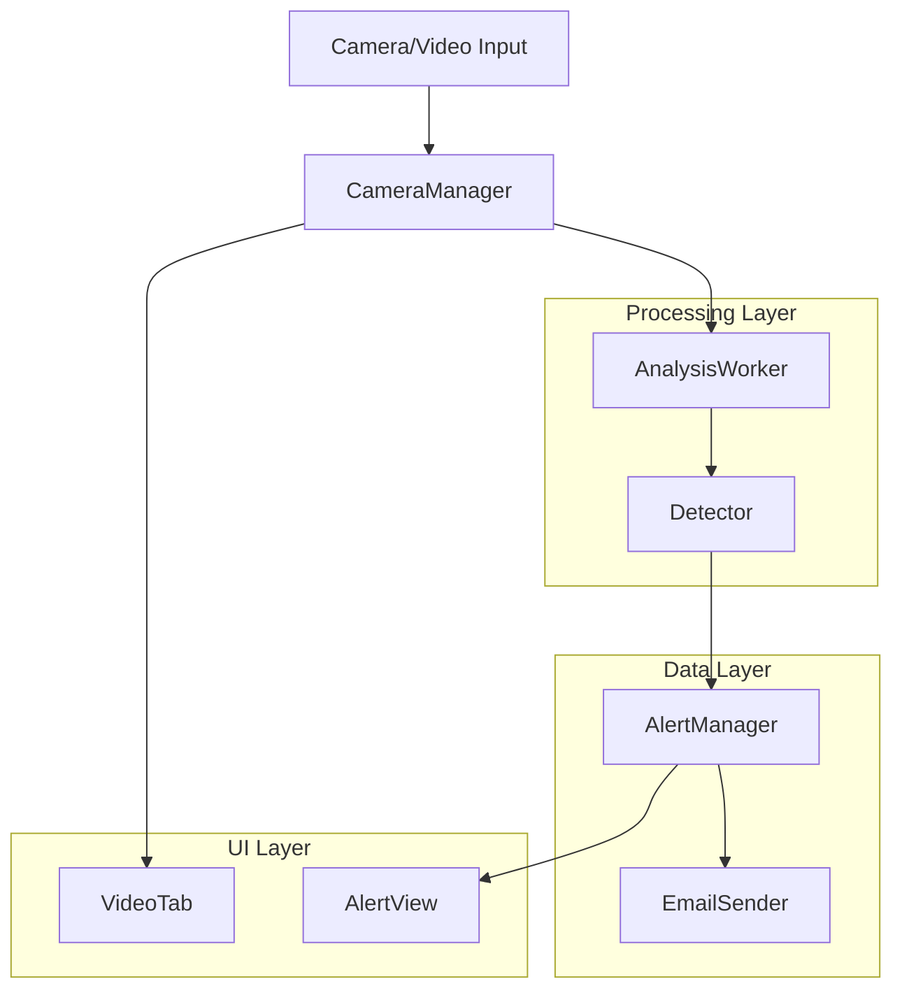
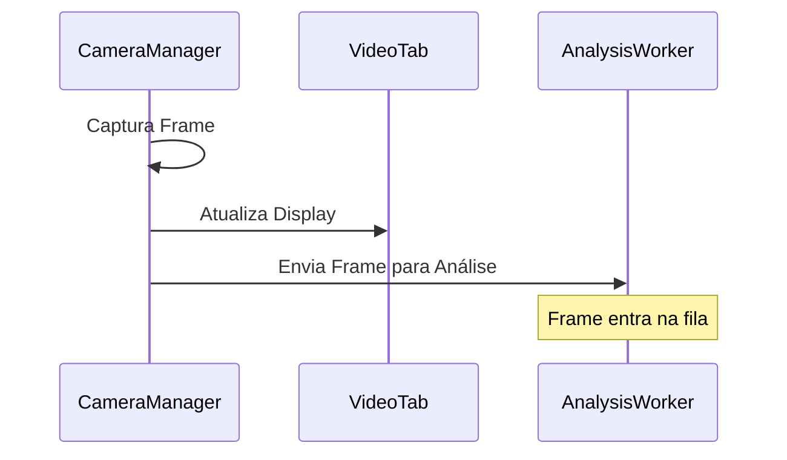
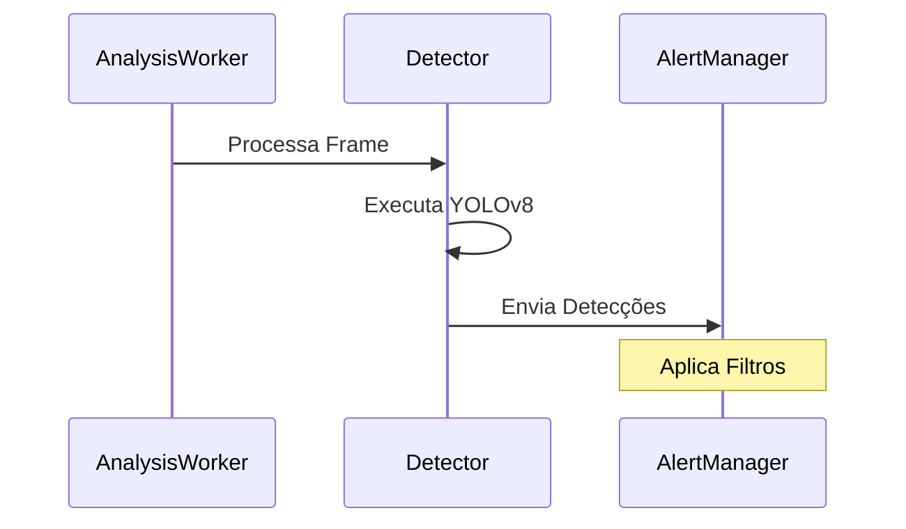
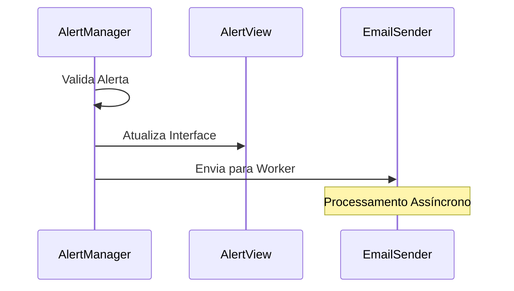
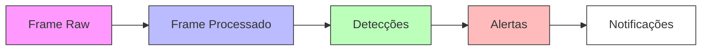
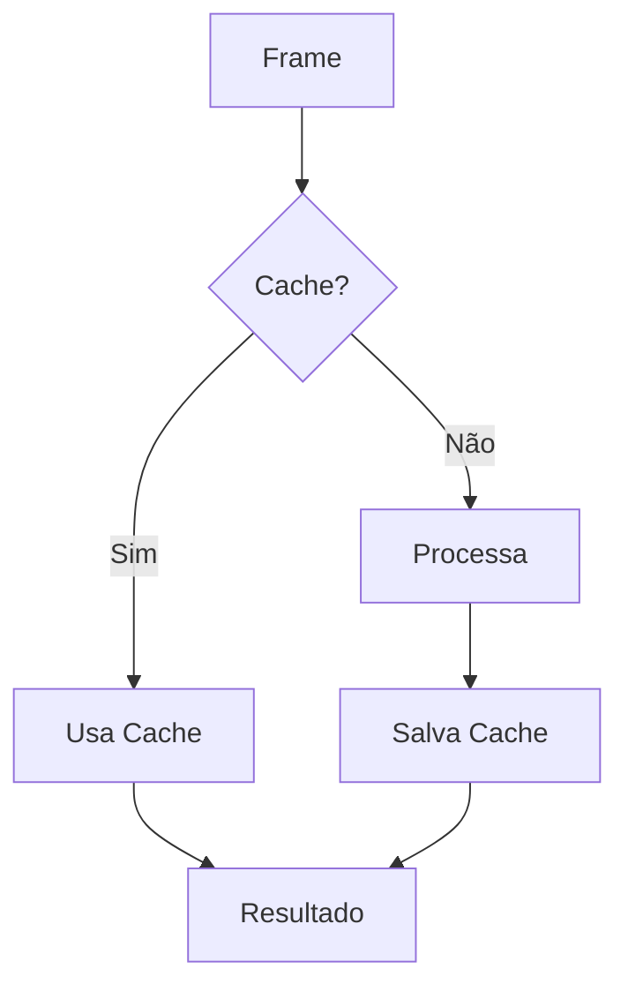
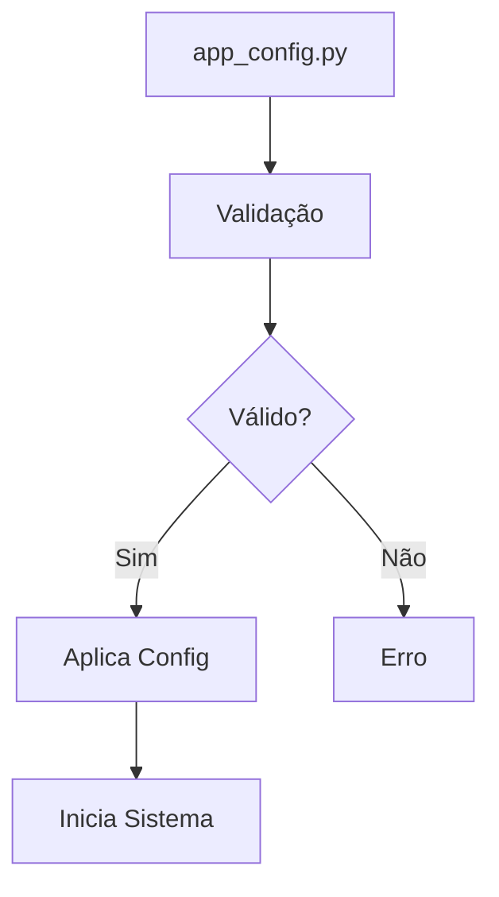
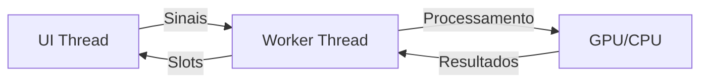

# Fluxo de Dados do VisionGuard

## Diagrama de Fluxo Principal

## Fluxo de Processamento Detalhado

1. **Captura de Vídeo**

2. **Análise e Detecção**

3. **Gerenciamento de Alertas**

## Ciclo de Vida dos Dados

## Sistema de Cache e Otimização

## Fluxo de Configuração

## Comunicação Assíncrona

## Notas de Implementação

1. **Threads e Sinais**
   - UI Thread: Não bloqueante
   - Worker Thread: Processamento pesado
   - Comunicação via Qt Signals/Slots

2. **Otimizações**
   - Cache de frames
   - Buffer circular
   - Batch processing
   - GPU acceleration

3. **Pontos de Monitoramento**
   - Performance metrics
   - Error logging
   - Resource usage
   - Detection stats