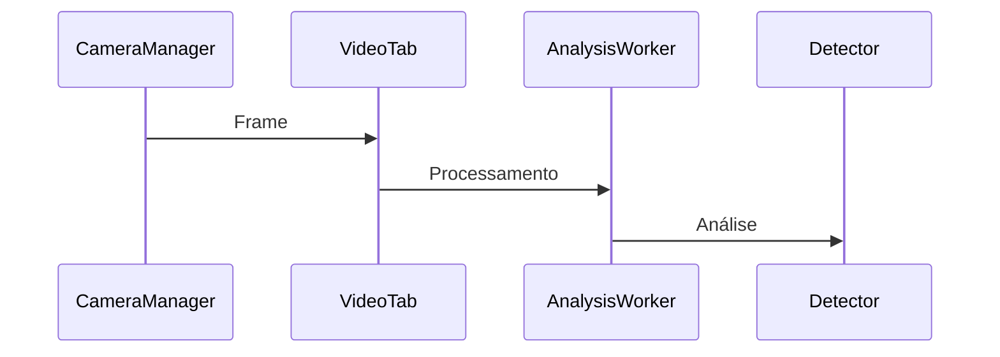

# Guia de Apresentação Técnica - VisionGuard

## 1. Introdução (2-3 minutos)

### 1.1 Visão Geral do Sistema
- Sistema de monitoramento em tempo real
- Detecção de objetos com YOLOv8
- Processamento assíncrono e otimizado
- Interface gráfica intuitiva

### 1.2 Arquitetura em Camadas
- UI Layer: Interface do usuário
- Processing Layer: Processamento de vídeo
- Core Layer: Detecção e alertas
- Data Layer: Persistência e configurações

## 2. Componentes Principais (5-7 minutos)

### 2.1 Sistema de Detecção (detector.py)
- Modelo YOLOv8 otimizado
- Processamento em GPU/CPU
- Sistema de cache inteligente
- Gerenciamento de recursos

### 2.2 Processamento Assíncrono (analysis_worker.py)
- Workers dedicados
- Fila de processamento
- Balanceamento de carga
- Métricas em tempo real

### 2.3 Gerenciamento de Alertas (alert_manager.py)
- Validação de detecções
- Sistema de persistência
- Rotação automática
- Notificações por email

### 2.4 Interface do Usuário (main_window.py)
- Design modular
- Múltiplas visualizações
- Controles intuitivos
- Feedback em tempo real

## 3. Fluxo de Processamento (4-5 minutos)

### 3.1 Captura de Vídeo

### 3.2 Pipeline de Detecção
- Redimensionamento inteligente
- Processamento em batch
- Filtros de confiança
- Cache de resultados

### 3.3 Sistema de Alertas
- Validação de detecções
- Geração de alertas
- Notificações por email
- Armazenamento persistente

## 4. Otimizações Implementadas (3-4 minutos)

### 4.1 Performance
- Workers assíncronos
- Cache multi-nível
- Processamento em batch
- Gerenciamento de memória

### 4.2 Interface
- Renderização eficiente
- Updates em batch
- Throttling de eventos
- Cache de UI

### 4.3 Recursos
- Buffer circular
- Compressão de dados
- Limpeza automática
- Monitoramento de uso

## 5. Demonstração Prática (5-6 minutos)

### 5.1 Inicialização do Sistema
- Carregamento do modelo
- Configuração de workers
- Inicialização da interface

### 5.2 Funcionalidades
- Conexão com câmera/vídeo
- Detecção em tempo real
- Geração de alertas
- Navegação no histórico

### 5.3 Métricas
- Performance do sistema
- Taxa de detecção
- Uso de recursos
- Tempo de processamento

## 6. Considerações Técnicas (2-3 minutos)

### 6.1 Requisitos
- Python 3.8+
- CUDA (opcional)
- 8GB+ RAM
- CPU multi-core

### 6.2 Pontos de Extensão
- Suporte multi-modelo
- Integrações externas
- Customização de alertas
- Exportação de dados

## Tempo Total Estimado: 20-25 minutos

## Notas para Apresentação

### Pontos-Chave
1. Enfatizar processamento assíncrono
2. Demonstrar otimizações de performance
3. Mostrar sistema de alertas em ação
4. Destacar métricas em tempo real

### Dicas
- Usar diagramas para explicar fluxos
- Demonstrar casos de uso reais
- Mostrar métricas durante operação
- Responder questões técnicas com exemplos

### Materiais de Suporte
- Documentação técnica completa em /docs/technical/
- Diagramas de arquitetura
- Exemplos de código
- Métricas de benchmark