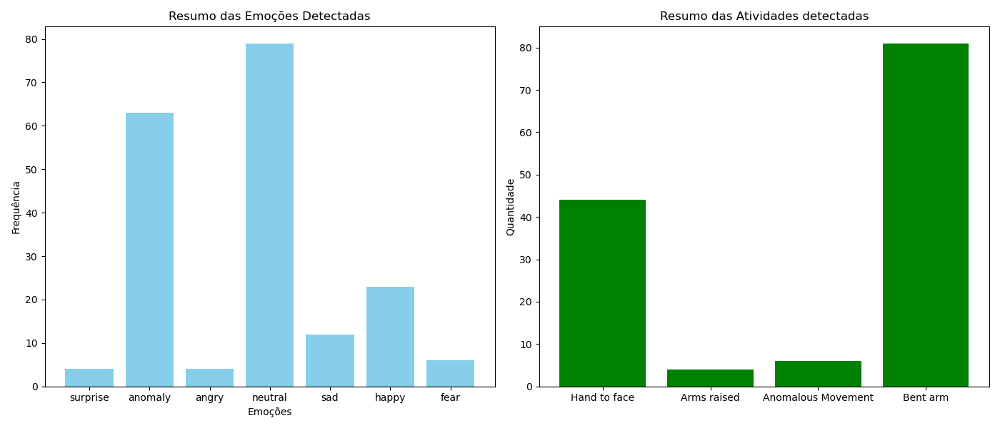

# Análise de Vídeo com Reconhecimento Facial e Detecção de Atividades

Este projeto é uma aplicação em Python que realiza a análise de um vídeo, utilizando técnicas de reconhecimento facial, análise de expressões emocionais, detecção de atividades e geração de resumo de texto. O vídeo a ser analisado deve estar na raiz do projeto com o nome `video-tc4.mp4`.

## Integrantes do Grupo 18
*Rafael RM356292*

*Lucas RM355916*

*Lucca RM353944*

*Paulo RM355014*

*Fábio RM354943*

## Link para o vídeo de Apresentação
https://youtu.be/9d5AnIqMf1o

## Funcionalidades

1. **Reconhecimento Facial:** Identifica e marca os rostos presentes no vídeo.
2. **Análise de Expressões Emocionais:** Detecta emoções predominantes como felicidade, tristeza, raiva, neutralidade, entre outras.
3. **Classificação Anômalas:** Classifica emoções anômalas quando múltiplas emoções significativas são detectadas em um rosto.
4. **Detecção de Atividades:** Detecta movimentos como braços levantados, mãos próximas ao rosto ou braços curvados.
5. **Classificação de Atividades Anômalas:** Classifica atividades anômalas quando múltiplos movimentos divergentes ocorrem simultaneamente.
5. **Resumo e Visualização:** Gera gráficos que resumem as emoções e atividades detectadas.
6. **Vídeo Processado com Marcações:** Salva o vídeo com marcações visuais indicando emoções e atividades detectadas.

## Tecnologias Utilizadas

- **Python:** Linguagem principal do projeto.
- **Bibliotecas:**
  - `DeepFace`: Para análise de expressões emocionais.
  - `mediapipe`: Para detecção de atividades corporais.
  - `opencv-python`: Para manipulação de vídeo.
  - `matplotlib`: Para geração de gráficos e visualizações.

## Pré-requisitos

Antes de executar o projeto, certifique-se de ter o Python 3.x e as bibliotecas necessárias instaladas. Instale as dependências com o comando:

```bash
pip install deepface mediapipe opencv-python matplotlib --user
```

## Estrutura do Projeto
```
/project-root
│
├── video-tc4.mp4         # Vídeo a ser analisado
├── tc-4.py               # Código principal para análise do vídeo
├── output_video.mp4      # Vídeo processado com as marcações (gerado pelo script)
└── README.md             # Documentação do projeto
```
## Como Executar o Projeto
1- Clone ou baixe o repositório para o seu computador.

2- Navegue até a pasta do projeto.

3- Execute o script Python com o seguinte comando:
```
python tc-4.py
```

4- Resultados Gerados:
* Um vídeo processado será salvo como output_video.mp4, com marcações das emoções e atividades detectadas.
* Resumo exibido no console, incluindo: (Total de frames analisados, Número de anomalias detectadas, Resumo das atividades e emoções)

5- Visualização Gráfica:
* Após a execução, gráficos das atividades e emoções detectadas serão exibidos.


### OBS
- Caso esteja utilizando windows pode ser preciso instalar o [Build-tools](https://visualstudio.microsoft.com/pt-br/visual-cpp-build-tools/)

## Descrição técnica do projeto

### Importações

```python
import os
import cv2
from deepface import DeepFace
import mediapipe as mp
import matplotlib.pyplot as plt
```

### Bibliotecas utilizadas

- **`os`**: Gerencia arquivos e diretórios no sistema operacional.
- **`cv2` (OpenCV)**: Manipula vídeos e imagens, permitindo leitura, exibição e gravação.
- **`DeepFace`**: Detecta rostos e emoções em imagens ou frames de vídeo.
- **`mediapipe`**: Detecta poses corporais e landmarks (pontos de referência anatômicos).
- **`matplotlib.pyplot`**: Gera gráficos para visualização dos dados analisados.

### Definições iniciais

```python
VIDEO_PATH = "video-tc4.mp4"
OUTPUT_VIDEO_PATH = "output_video.mp4"
FRAMES_INTERVAL_TO_ANALYZE = 15
```

- **`VIDEO_PATH`**: Caminho do vídeo a ser analisado.
- **`OUTPUT_VIDEO_PATH`**: Caminho para salvar o vídeo anotado.
- **`FRAMES_INTERVAL_TO_ANALYZE`**: Intervalo de frames para análise (1 em cada 15).

### Inicialidação do mediapipe

```python
mp_pose = mp.solutions.pose
pose_detector = mp_pose.Pose(static_image_mode=True, min_detection_confidence=0.5)
```

- **`mp_pose`**: Acessa a solução de pose do MediaPipe.
- **`pose_detector`**: Detector de poses configurado para imagens estáticas com 50% de confiança mínima.

## Funções

### 1. analyze_emotions (análise de emoções):

```python
def analyze_emotions(frame):
    ...
```

#### Detecção de Rostos e Emoções com DeepFace

1. **Processo de Detecção**:
   - O frame é analisado para detectar rostos e emoções.
   - **Modelos utilizados**:
     - **`mtcnn`**: Primeiro modelo utilizado, rápido e preciso.
     - **`retinaface`**: Usado como alternativa caso `mtcnn` falhe, mais robusto para rostos em ângulos variados porem menos performático.

2. **Análise de Emoções**:
   - Para cada rosto detectado:
     - Calcula a **emoção dominante** com base nas pontuações das emoções.
     - Regras de classificação:
       - Se a confiança da emoção dominante for **menor que 60%**, marca como **"neutral"**.
       - Se múltiplas emoções forem confiáveis (**> 20% de confiança cada**), classifica como **"anomaly"**.

### 2. detect_activities (Detecção de Atividades Corporais):

```python
def detect_activities(frame):
    ...
```

#### Detecção de Atividades Corporais com MediaPipe

1. **Preparação do Frame**:
   - O frame é convertido para o formato **RGB**, pois o MediaPipe requer essa configuração.

2. **Detecção de Landmarks**:
   - Identifica os landmarks corporais (pontos de referência do corpo) no frame.

3. **Identificação de Atividades**:
   - **Braços levantados**: Pulsos estão acima da cabeça.
   - **Mão ao rosto**: Pulsos estão próximos ao nariz.
   - **Braço curvado**: Pulso está na altura do cotovelo e abaixo do nariz.

4. **Classificação de Movimentos Anômalos**:
   - Se múltiplas atividades inconsistentes forem detectadas ao mesmo tempo, o movimento é classificado como **"Anomalous Movement"**.

### 3. Relatórios e Gráficos

#### 1. **Geração de Relatórios**
- **Função `generate_report(report)`**:
  - Exibe um resumo textual com os seguintes dados:
    - Total de frames analisados.
    - Contagem de emoções detectadas.
    - Contagem de atividades detectadas.

#### 2. **Criação de Gráficos**
- **Função `generate_graphics(report)`**:
  - Gera gráficos de barras para visualização:
    - **Resumo das emoções detectadas**.
    - **Resumo das atividades detectadas**.

### 4. analyze_video (Análise de Vídeo)

```python
def analyze_video(video_path):
    ...
```

#### Processo de Análise de Vídeo

#### 1. **Carregamento do Vídeo**
- **Verificações iniciais**:
  - Certifica-se de que o arquivo existe e possui a extensão `.mp4`.
- **Leitura do vídeo**:
  - Utiliza `cv2.VideoCapture` para carregar o vídeo.
- **Configuração do gravador**:
  - Configura um gravador para salvar o vídeo anotado.

#### 2. **Processamento dos Frames**
- **Intervalo de análise**:
  - Apenas frames a cada **`FRAMES_INTERVAL_TO_ANALYZE`** são analisados para otimizar o desempenho.
- **Etapas de processamento**:
  - Detecta **rostos** e **atividades corporais** no frame atual.
  - Adiciona anotações no frame (emoções detectadas e atividades identificadas).
  - Duplica o frame processado no vídeo de saída para prolongar sua duração.

#### 3. **Relatório Final**
- **Geração de dados**:
  - Conta as ocorrências de cada atividade e emoção detectada.
- **Saída**:
  - Retorna um relatório que pode ser visualizado de forma gráfica e textual.

## Relatório de Análise

- **Total de frames analisados**: 221  
- **Número de anomalias detectadas**: 0  

### Resumo das Atividades
| Atividade            | Ocorrências |
|-----------------------|-------------|
| Hand to face         | 44          |
| Arms raised          | 4           |
| Anomalous Movement   | 6           |
| Bent arm             | 81          |

### Resumo das Emoções
| Emoção     | Ocorrências |
|------------|-------------|
| Surprise   | 4           |
| Anomaly    | 63          |
| Angry      | 4           |
| Neutral    | 79          |
| Sad        | 12          |
| Happy      | 23          |
| Fear       | 6           |

## Gráfico Gerado


